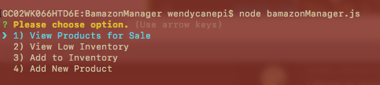
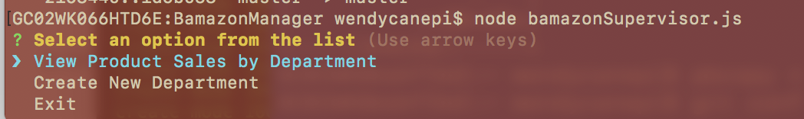
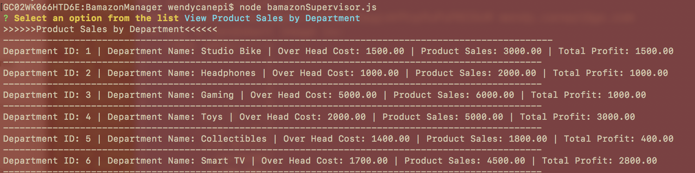

### Overview
## What is BamazonManager/BamazonSupervisor?

**BamazonManager** - a command-line (CLI) based Admin tool for our Bamazon storefront application (developed in an earlier assignment). **BamazonManger** (much like Bamazon) is built with Node.js, MySQL and Inquirer.

The **BamazonManager** application functions as the 
Administration/Maintenance arm for the Bamazon app.
It provides the following features:

1. View all the Products currently for sale
2. View Low Stock Inventory
3. Add items to the Inventory
4. Add new Products to the store

The **BamazonSupervisor** application functions as an additional Administration/Maintenance arm for the Bamazon app.

It provides the following features:

1. View Product Sales by Department
2. Create New Department


## How to run BamazonManager

```node bamazonManager.js```

### Let's step through the Bamazon experience: 



## How to run BamazonSupervisor

```node bamazonSupervisor.js```

### Let's step through the BamazonSupervisor experience: 




